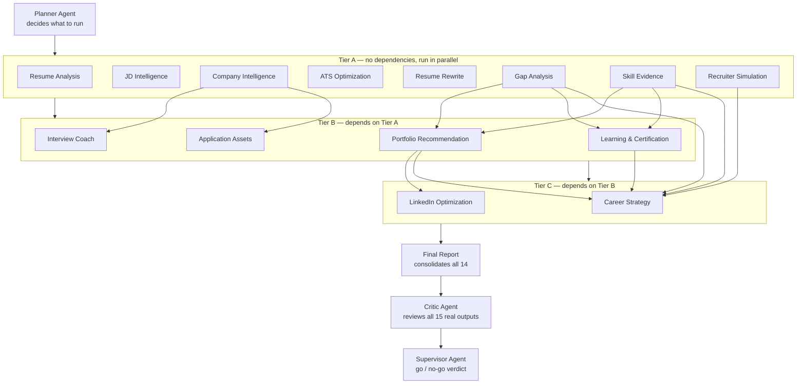
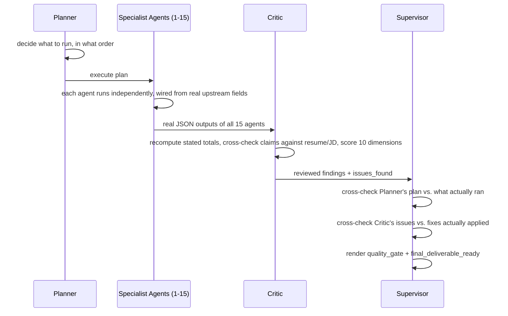

# Architecture

## System diagram

This is the exact dependency graph `pipeline.py` executes — computed by a topological sort over `core/registry.py`'s `AGENT_REGISTRY`, not a hardcoded sequence. If an agent's real dependencies change, updating its `AgentSpec.depends_on` entry changes execution order automatically; nothing in `pipeline.py` needs to change.

## Layers

**1. Extraction agents** (Resume Analysis, JD Intelligence, ATS Optimization, Resume Rewrite, Gap Analysis, Skill Evidence, Recruiter Simulation, Interview Coach, LinkedIn Optimization, Application Assets) read raw resume/JD text and re-derive their own findings independently. This keeps them testable in isolation and lets Critic Agent cross-check their outputs for consistency later, rather than one agent's error silently propagating unchallenged.

**2. Research agents** (Company Intelligence, Learning & Certification, Career Strategy) answer questions about the real world — a specific company, real courses, current salary data — where parametric model knowledge is unreliable or stale. Each runs in **two phases**: a live `web_search`-enabled call first, then a separate non-searching call that structures the researched text into the agent's schema. This keeps "did we research this correctly" and "did we format this correctly" as independent, separately-verifiable concerns.

**3. Synthesis agents** (Portfolio Recommendation, Final Report) don't re-read the resume/JD — they compose *other agents' already-structured findings* into a new artifact. Portfolio Recommendation's `gaps_to_close` comes from Gap Analysis's `critical_gaps` field directly, not from re-deriving gaps from text.

**4. Orchestration agents** (Planner, Critic, Supervisor) reason about the *other 15 agents*, not about resumes or JDs. All three are grounded in the same `AGENT_REGISTRY`, so none of them can invent an agent that doesn't exist or a dependency edge that isn't real — every `agent_id` and `depends_on` reference either agent produces is checkable against one shared source of truth.

## The governance loop

This loop is what makes the system self-checking rather than "trust the model": Critic Agent's sample review caught a real arithmetic bug (Learning & Certification's stated total didn't match its own line items) by actually recomputing the numbers, not just re-reading the prose — and Supervisor Agent's job is to verify that finding was actually fixed, not just assume it was.

## Contract every agent follows

- A declared Pydantic `input_model` and `output_model` — the output schema doubles as the Anthropic tool schema, forcing the model to return valid, typed JSON via tool-call, never free text to parse.
- A `system_prompt` written from a professional persona (senior recruiter, ATS expert, etc.) with an explicit non-fabrication rule.
- A `build_user_prompt(data) -> str` method turning validated input into the model-facing prompt.

See `career_copilot/core/base_agent.py` for the shared `BaseAgent[TIn, TOut]` template this enforces, and `docs/agents/*.md` for each agent's specific inputs/outputs/limitations.
